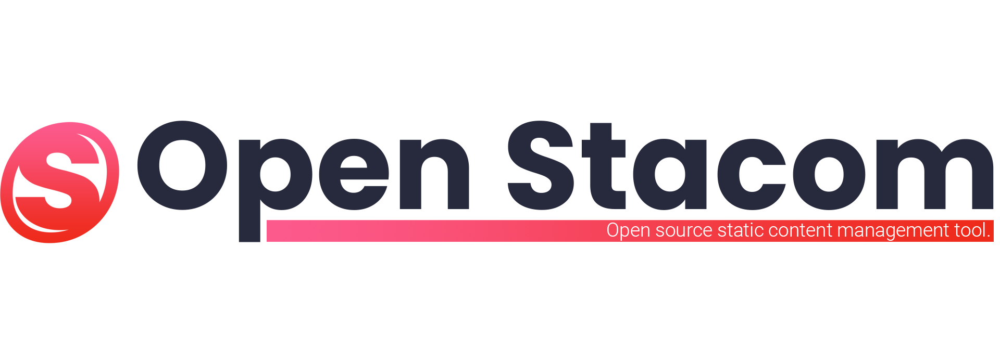

# Open-Stacom
###### An open source static content management tool.
###### Uma ferramenta open source para gerenciamento de conteúdo estático.
## About this project
Uma ferramenta open source desenvolvida para gerenciamento de conteúdo de forma estática para páginas de eventos diversos.

## Geting Started
You will need to install all system requirements to edit and change any 
parts of this project. The following are listed all requirements.

## Project Structure
cooming soon

## Version Control Documentation
This topic explains how the project version control in this repository 
works.

#### How to Contribute
-

## Authors
* **Lucas Fonseca dos Santos** - *Computer Science student of Federal 
University of Lavras* - lucas@lcfcompany.com.br

## License
This project is under GPLv3 - General Public License. Copyleft is freedom!

